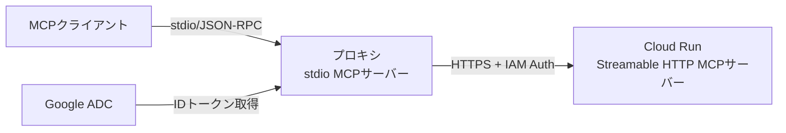

# 設計ドキュメント

## 概要

このプロキシツールは、Google Cloud Run上でIAM認証付きでホストされているStreamable HTTP方式のMCPサーバーに対して、ローカルのApplication Default Credentials (ADC)を使用して接続するプロキシとして機能します。プロキシ自体はstdio方式のMCPサーバーとして動作し、MCPクライアントとCloud Run上のサーバー間の通信を仲介します。

## アーキテクチャ

### 全体構成



### レイヤー構成

プロジェクトの標準的なディレクトリ構造に従い、以下のレイヤーで実装します：

1. **Presentation層** (`src/presentation/`)
   - CLIハンドラー
   - 引数パース
   - stdio通信の管理

2. **Usecase層** (`src/usecase/`)
   - MCPメッセージの処理ロジック
   - プロキシのコア機能

3. **Libs層** (`src/libs/`)
   - Google Cloud認証
   - HTTP通信
   - JSON-RPCパーサー
   - エラーハンドリング

## コンポーネントと インターフェース

### 1. CLI エントリーポイント

**責務**: コマンドライン引数の処理とプロキシの起動（gunshiを使用）

```typescript
// src/presentation/cli.ts
import { cli, define } from 'gunshi';
import type { CommandContext } from 'gunshi';

// gunshiで型安全なコマンド定義
const proxyCommand = define({
  name: 'mcp-gcloud-adc-proxy',
  description: 'Google Cloud Run MCP Server Proxy with ADC authentication',
  args: {
    url: {
      type: 'string',
      short: 'u',
      required: true,
      description: 'Cloud Run service URL (must be HTTPS)'
    },
    timeout: {
      type: 'number',
      short: 't',
      default: 120000,
      description: 'HTTP request timeout in milliseconds'
    },
    verbose: {
      type: 'boolean',
      short: 'v',
      description: 'Enable verbose logging'
    }
  },
  run: async (ctx: CommandContext) => {
    // プロキシの起動処理
    await startProxy(ctx.values);
  }
});

type CliArgs = {
  url: string;
  timeout: number;
  verbose: boolean;
};
```

### 2. Stdio MCPサーバー

**責務**: stdio経由でのMCPプロトコル通信（@modelcontextprotocol/sdkを使用）

```typescript
// src/presentation/stdio-server.ts
import { Server } from '@modelcontextprotocol/sdk/server/index.js';
import { StdioServerTransport } from '@modelcontextprotocol/sdk/server/stdio.js';

type StdioServerConfig = {
  serverName: string;
  serverVersion: string;
  onRequest: (request: JsonRpcRequest) => Promise<JsonRpcResponse>;
};

// MCPサーバーの初期化
async function createStdioServer(config: StdioServerConfig): Promise<Server> {
  const server = new Server(
    {
      name: config.serverName,
      version: config.serverVersion,
    },
    {
      capabilities: {
        tools: {},
        resources: {},
      },
    }
  );

  // stdioトランスポートの設定
  const transport = new StdioServerTransport();
  await server.connect(transport);

  return server;
}
```

### 3. MCPプロキシ処理

**責務**: MCPメッセージの転送とレスポンス処理

```typescript
// src/usecase/mcp-proxy.ts
import type { RequestMessage, ResponseMessage } from '@modelcontextprotocol/sdk/types.js';

type McpProxy = {
  handleRequest: (request: RequestMessage) => Promise<ResponseMessage>;
};

type ProxyConfig = {
  targetUrl: string;
  timeout: number;
  authClient: AuthClient;
  httpClient: HttpClient;
};

// プロキシ実装
class McpProxyHandler implements McpProxy {
  constructor(private config: ProxyConfig) {}

  async handleRequest(request: RequestMessage): Promise<ResponseMessage> {
    // 1. IDトークンの取得
    const tokenResult = await this.config.authClient.getIdToken();
    if (tokenResult.type === 'error') {
      throw new Error(`Auth failed: ${tokenResult.error.message}`);
    }

    // 2. HTTPリクエストの送信
    const response = await this.config.httpClient.post({
      url: this.config.targetUrl,
      headers: {
        'Authorization': `Bearer ${tokenResult.token}`,
        'Content-Type': 'application/json',
      },
      body: request,
      timeout: this.config.timeout,
    });

    // 3. レスポンスの処理
    if (response.type === 'error') {
      throw new Error(`HTTP error: ${response.error.message}`);
    }

    return response.data as ResponseMessage;
  }
}
```

### 4. Google Cloud認証

**責務**: Application Default CredentialsからIDトークンの取得

```typescript
// src/libs/auth/google-auth.ts
type AuthClient = {
  getIdToken: () => Promise<GetIdTokenResult>;
  refreshToken: () => Promise<GetIdTokenResult>;
};

type GetIdTokenResult =
  | { type: 'success'; token: string; expiresAt: Date }
  | { type: 'error'; error: AuthError };

type AuthError =
  | { kind: 'no-credentials'; message: string }
  | { kind: 'invalid-audience'; message: string }
  | { kind: 'token-fetch-failed'; message: string };
```

### 5. HTTP クライアント

**責務**: Cloud RunサーバーへのHTTP通信とストリーミング処理

```typescript
// src/libs/http/http-client.ts
type HttpClient = {
  post: (config: HttpRequestConfig) => Promise<HttpResponse>;
  postStream: (config: HttpRequestConfig) => AsyncIterable<StreamChunk>;
};

type HttpRequestConfig = {
  url: string;
  headers: Record<string, string>;
  body: unknown;
  timeout: number;
};

type HttpResponse =
  | { type: 'success'; data: unknown; status: number }
  | { type: 'error'; error: HttpError };

type HttpError =
  | { kind: 'network-error'; message: string }
  | { kind: 'timeout'; message: string }
  | { kind: 'http-error'; status: number; message: string };

type StreamChunk = {
  data: string;
  isLast: boolean;
};
```

### 6. MCP SDK統合

**責務**: @modelcontextprotocol/sdkのServer実装とプロキシの統合

```typescript
// src/libs/mcp/server-setup.ts
import { Server } from '@modelcontextprotocol/sdk/server/index.js';
import { StdioServerTransport } from '@modelcontextprotocol/sdk/server/stdio.js';
import type { CallToolRequestSchema, ListToolsRequestSchema } from '@modelcontextprotocol/sdk/types.js';

type ServerSetupConfig = {
  name: string;
  version: string;
  proxy: McpProxy;
};

async function setupMcpServer(config: ServerSetupConfig): Promise<Server> {
  const server = new Server(
    {
      name: config.name,
      version: config.version,
    },
    {
      capabilities: {
        tools: {},
        resources: {},
      },
    }
  );

  // リクエストハンドラーの設定
  server.setRequestHandler(ListToolsRequestSchema, async (request) => {
    // Cloud Runサーバーにリクエストを転送
    const response = await config.proxy.handleRequest(request);
    return response;
  });

  server.setRequestHandler(CallToolRequestSchema, async (request) => {
    // Cloud Runサーバーにリクエストを転送
    const response = await config.proxy.handleRequest(request);
    return response;
  });

  // stdioトランスポートに接続
  const transport = new StdioServerTransport();
  await server.connect(transport);

  return server;
}
```

## データモデル

### MCPメッセージ

@modelcontextprotocol/sdkで定義される型を使用：

```typescript
// @modelcontextprotocol/sdk/types.js から提供される型
import type {
  InitializeRequest,
  InitializeResult,
  CallToolRequest,
  CallToolResult,
  ListToolsRequest,
  ListToolsResult,
  ListResourcesRequest,
  ListResourcesResult,
  ReadResourceRequest,
  ReadResourceResult,
  RequestMessage,
  ResponseMessage,
  Notification,
} from '@modelcontextprotocol/sdk/types.js';

// プロキシで扱うメッセージ型
type ProxyableRequest =
  | InitializeRequest
  | CallToolRequest
  | ListToolsRequest
  | ListResourcesRequest
  | ReadResourceRequest;

type ProxyableResponse =
  | InitializeResult
  | CallToolResult
  | ListToolsResult
  | ListResourcesResult
  | ReadResourceResult;
```

### 設定

```typescript
type ProxySettings = {
  targetUrl: string;
  timeout: number;
  verbose: boolean;
  credentialsPath?: string; // GOOGLE_APPLICATION_CREDENTIALS
};
```

## エラーハンドリング

### エラー分類と処理戦略

1. **認証エラー**
   - ADC未設定 → 詳細な設定手順を表示して終了
   - トークン取得失敗 → リトライ後、MCPエラーレスポンス返却
   - 401/403エラー → 権限不足の詳細をログ出力、MCPエラー返却

2. **ネットワークエラー**
   - 接続失敗 → 再試行ロジック（指数バックオフ）
   - タイムアウト → MCPエラーレスポンス返却
   - DNSエラー → URLの妥当性チェック、エラーメッセージ

3. **プロトコルエラー**
   - 不正なJSON-RPC → パースエラーレスポンス（code: -32700）
   - 不明なメソッド → メソッドエラーレスポンス（code: -32601）
   - パラメータエラー → 無効パラメータレスポンス（code: -32602）

4. **内部エラー**
   - 予期しない例外 → ログ記録、内部エラーレスポンス（code: -32603）

### エラーレスポンス形式

```typescript
import { ErrorCode, McpError } from '@modelcontextprotocol/sdk/types.js';

// MCPエラーの生成
function createMcpError(code: ErrorCode, message: string, data?: unknown): McpError {
  return new McpError(code, message, data);
}

// 例：認証エラー
const authError = createMcpError(
  ErrorCode.InternalError,
  'Authentication failed',
  {
    originalError: 'Failed to get ID token',
    timestamp: new Date().toISOString()
  }
);
```

## テスト戦略

### ユニットテスト

各コンポーネントを独立してテストします：

1. **認証モジュール**
   - モックされたGoogleAuthライブラリでトークン取得をテスト
   - エラーケース（認証失敗、タイムアウト）のテスト

2. **HTTPクライアント**
   - モックHTTPレスポンスでの正常系テスト
   - ストリーミングレスポンスの処理テスト
   - タイムアウト、ネットワークエラーのテスト

3. **JSON-RPCパーサー**
   - 有効/無効なメッセージのパーステスト
   - エラーレスポンスの生成テスト

4. **MCPプロキシロジック**
   - 各MCPメソッドの転送テスト
   - エラーハンドリングのテスト

### 統合テスト

1. **End-to-Endフロー**
   - stdio入力 → Cloud Run（モック） → stdio出力の完全フロー
   - 認証フローを含む完全なリクエスト/レスポンスサイクル

2. **ストリーミングテスト**
   - 複数チャンクのストリーミングレスポンス処理
   - 中断されたストリームのハンドリング

3. **エラーシナリオ**
   - 認証失敗時の適切なエラーメッセージ
   - ネットワーク障害時のフォールバック

### テストツール

- **Vitest**: ユニットテストフレームワーク
- **power-assert**: アサーションライブラリ
- **モック戦略**: 依存性注入によるモックの容易化

## セキュリティ考慮事項

1. **認証情報の保護**
   - IDトークンをメモリ内でのみ保持
   - ログに認証情報を出力しない
   - 環境変数からの認証情報読み込み時の検証

2. **入力検証**
   - Cloud Run URLの妥当性チェック（HTTPSのみ許可）
   - JSON-RPCメッセージの厳密な検証
   - コマンドライン引数のサニタイゼーション

3. **通信の安全性**
   - Cloud Runへの通信はHTTPSのみ
   - TLS証明書の検証を有効化
   - タイムアウト設定による無限待機の防止

## パフォーマンス最適化

1. **トークンキャッシュ**
   - IDトークンを有効期限まで再利用
   - 期限切れ前の自動更新

2. **接続管理**
   - HTTP Keep-Aliveの活用
   - 接続プールの実装（将来的な拡張）

3. **ストリーミング処理**
   - チャンクごとの逐次処理
   - メモリ効率的なバッファリング
